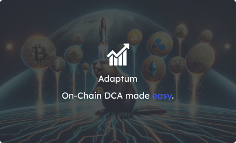

<a href="https://www.adaptum.finance"></a>

# [AdaptumFi](https://adaptum.xyz/) - The Future of DCA is Here!
## Powered by  Hyperlane &  Chainlink.

At AdaptumFi, we are building the future of DCA (Dollar Cost Averaging) by providing a decentralized, in an cross chain
& On-Chain manner, to help users invest in their favorite assets, without the need to worry about the market volatility.

## Features

- **Decentralized**: AdaptumFi is a decentralized platform, which means that the users have full control over their funds and investments.

- **Cross Chain**: AdaptumFi is a cross chain platform, which means that the users can invest in their favorite assets, across different blockchains of their choice.

- **Adaptive**: AdaptumFi is an on-chain platform using CBBI Index to adapt buy positions, which means that the users can invest in their favorite assets, without the need to worry about the market volatility.

- **DCA (Dollar Cost Averaging)**: AdaptumFi is a DCA platform, which means that the users can invest in their favorite assets, without the need to worry about the market volatility.

# Preview

The app is deployed on Vercel and can be accessed at [https://adaptum.xyz/](https://adaptum.xyz/)

## Getting started

Install dependencies

```bash
pnpm i
```

Copy `.env.example` to `.env.local` and set the environment variables

To get a Dynamic.xyz API key, visit [Dynamic.xyz](https://dynamic.xyz/)

## Deployed Contracts

| CONTRACTS              | ADDRESSES                                  | Network                                  |
|------------------------|--------------------------------------------|--------------------------------------------|
| X | x | x |
| x | x | x |
| x | x | x |
| x | x | x |
| x | x | x |

## Stack

- [Next.js](https://nextjs.org/)
- [TypeScript](https://www.typescriptlang.org/)
- [Tailwind CSS](https://tailwindcss.com/)
- [Wagmi] (https://wagmi.io/)
- [Dynamic.xyz](https://dynamic.xyz/)
- [Chainlink CCIP](https://chain.link)
- [CCTP](https://www.circle.com/en/cross-chain-transfer-protocol)
- [Hyperlane](https://hyperlane.xyz/)
- Multi-Chain (Ethereum (Sepolia), Arbitrum, Base (Sepolia))

## Authors

- [Magicred-1](https://github.com/Magicred-1/)
- [L0GYKAL](https://github.com/L0GYKAL)
- [TheoLeFur](https://github.com/TheoLeFur)
- [Marco75116](https://github.com/Marco75116)
